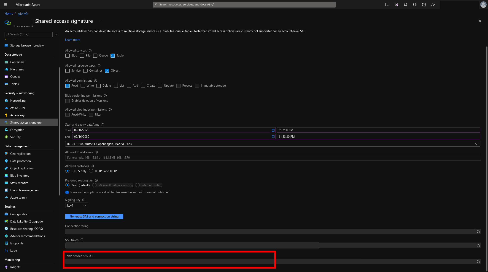

# How to generate a SAS URL to access an Azure table

Once the subscription table is created in the storage account, go on the storage account panel on [portal.azure.com](https://portal.azure.com) and click on `Shared access signature`. Fill the form as follow and click `Generate SAS and connection string`:

Please provide us with the SAS URL (in red on the screenshot).
